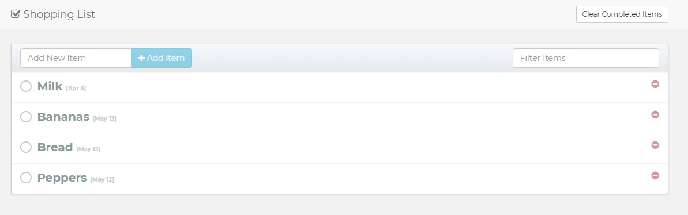
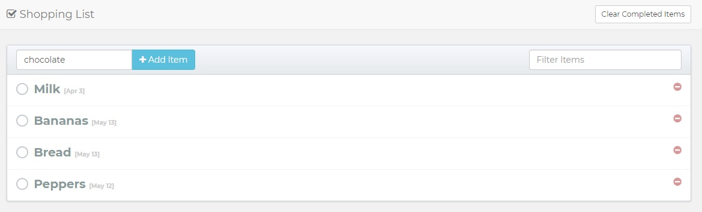
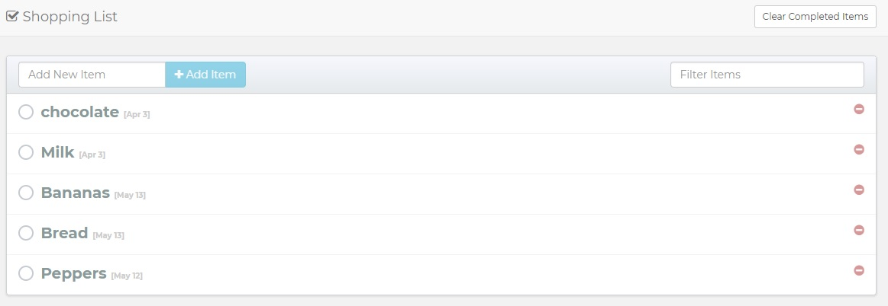
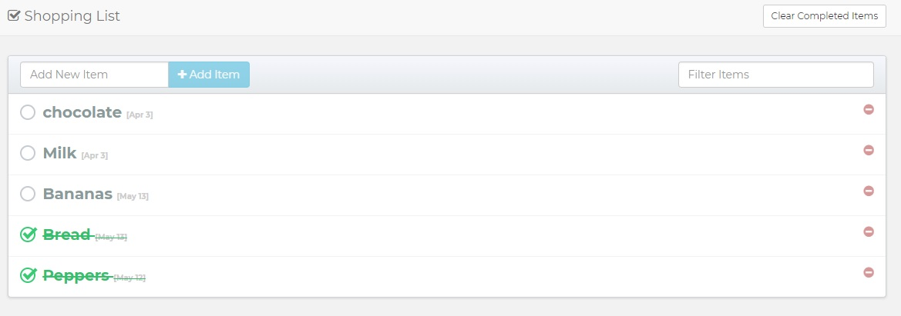
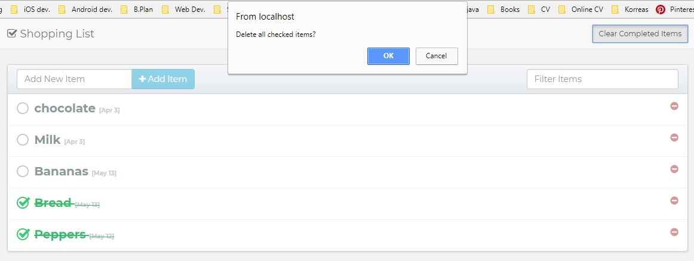
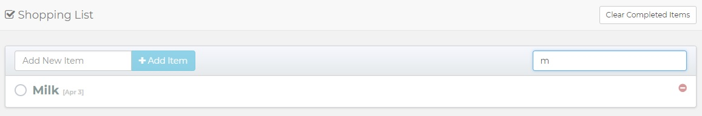
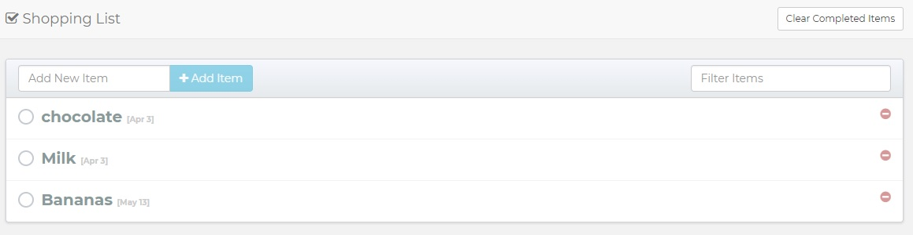

# AngularJS_CRUD

## Shopping List

I build a shopping list Web App working with AngularJS, MySQL and Bootstrap with little help from a tutorial. 
I will start from the index page and we will go with the photos to understand the structure of the App.

Let's add some items to our list.

You can mark some items as Done from your list and you can delete them.

You can also filter the items of your list to find them faster.

And that's it.It's simple but good for practice.

